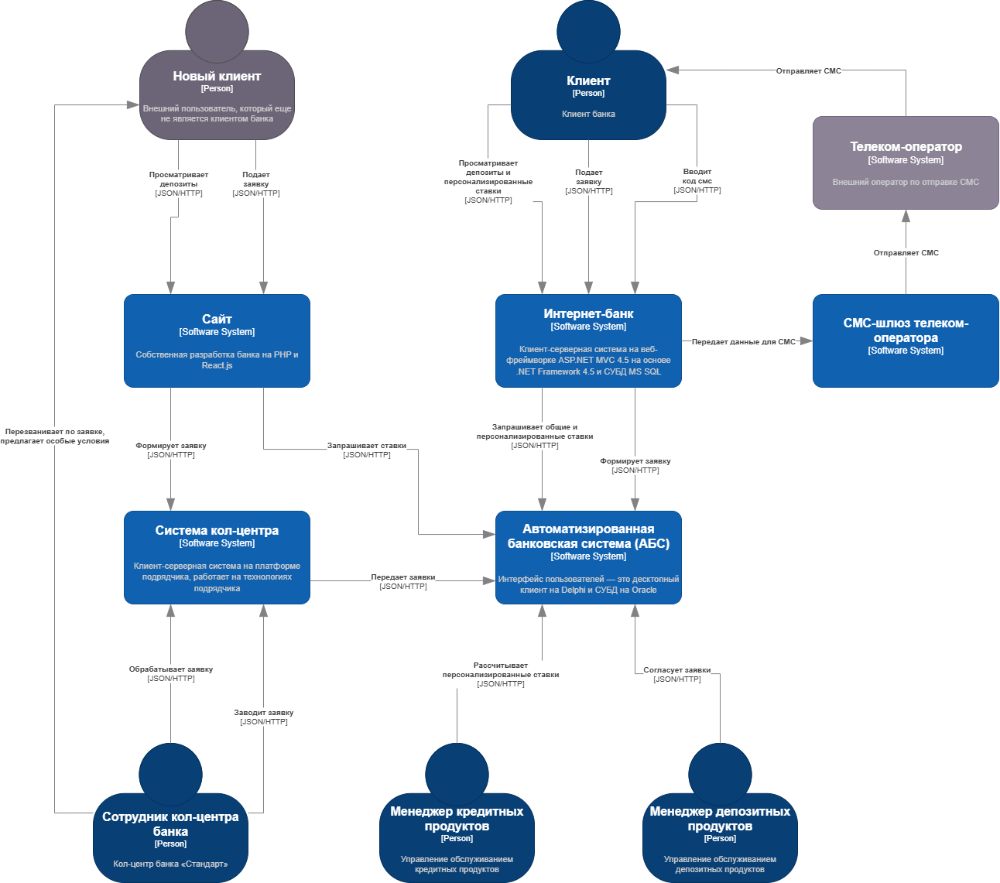
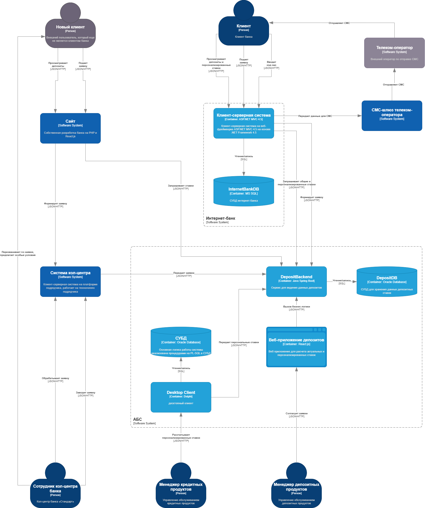

### **Название задачи: Открытие депозитов онлайн**

### **Автор: Вертипрахов Илья**

### **Дата: 27.08.2025**

### **Функциональные требования**

| **№** | **Действующие лица или системы**        | **Use Case**                                                                                                                                                                              | **Описание**                                                                                                                                                                                                                                                                                                                                                                                                                                              |
| :------: | :----------------------------------------------------------------- | :------------------------------------------------------------------------------------------------------------------------------------------------------------------------------------------ | :------------------------------------------------------------------------------------------------------------------------------------------------------------------------------------------------------------------------------------------------------------------------------------------------------------------------------------------------------------------------------------------------------------------------------------------------------------------ |
|  UC1  | Новый клиент, сайт                                | Просмотр доступных депозитов с актуальными ставками                                                                                         | 1. Клиент находится на сайте 2. Клиент просматривает список доступных депозтов с актуальными ставками 3. Сайт обращается в АБС за актуальными ставками и отображает их клиенту                                                                                                                           |
|  UC2  | Новый клиент, сайт                                | Подача заявки на депозит                                                                                                                                             | 1. Клиент переходит на сайт и вводит свой номер телефона и Ф. И. О. 2. Менеджер кол-центра изучает заявку 3. Менеджер кол-центра перезванивает клиенту 4. Менеджер кол-центра может предложить персональную ставку                                                           |
|  UC3  | Клиент, интеренет-банк                        | Просмотр доступных депозитов с актуальными ставками и персонализированными ставками лично для него | 1. Клиент находится в интернет-банке 2. Клиент просматривает список доступных депозитов с актуальными и персонализированными ставками 3. Интернет-банк обращается в АБС за актуальными и персонализированными ставками и отображает их клиенту |
|  UC4  | Клиент, интернет-банк                          | Подача заявки на открытие депозита                                                                                                                          | 1. Клиент указывает счёт и сумму депозита 2. Интернет-банк отправляет СМС с кодом 3. Клиент вводит код 4. При успехе в системе АБС формируется заявка                                                                                                                                                                          |
|  UC5  | Менеджер кредитных продуктов, АБС   | Ведение ставок по депозитам                                                                                                                                       | 1. Сотрудник находится в десктопном клиенте 2. Сотрудник рассчитывает актуальные и персонализированные ставки 3. Сотрудник сохраняет ставки                                                                                                                                                                                        |
|  UC6  | Менеджер депозитных продуктов, АБС | Согласование заявок                                                                                                                                                     | 1. Сотрудник выбирает заявку для согласования 2. Сотруднико брабатывает заявку и согласует ставку                                                                                                                                                                                                                                                                           |

### **Нефункциональные требования**

Опишите здесь нефункциональные требования и архитектурно значимые требования.

| **№** | **Требование**                                                                                                                                        |
| :------: | :---------------------------------------------------------------------------------------------------------------------------------------------------------------- |
|   R1   | Сервисы должны работать 24/7 и быть доступны в 99,9% случаев                                                          |
|   R2   | Чувствительные данные должны быть защищены при передаче                                                        |
|   R3   | Избегать прямой работы интернет-банка с API АБС                                                                            |
|   P1   | Равномерное горизонтальное масштабирование и распределение запросов между серверами |
|   P2   | АБС должна выдерживать нагрузку от новых онлайн-заявок                                                           |
|   S1   | Использвание существующих в компании технологий и компонентов (MS SQL, Oracle, .NET, Java)               |

### **Решение**

Диаграмма контекста:

Диаграмма контейнеров:

В представленном решении основной упор сделан на то, чтобы распределить нагрузку на систему АБС и упростить работу менеджеров бэк-офиса. Для этого добавлен сервис ведения данных депозитов и обновленный веб-интерфейс для работы менеджеров бэк-офиса. При этом учтены технологические компетенции сотрудников IT отдела. В системе интернет-банка больших изменений не планируется, кроме перенаправления запросов на новый сервис бэк-офиса. Данное решение позволит постепенно отказаться от поддержки устаревших и трудно расширяемых решений в системе АБС: десктопный клиент на Delphi и монолит с перегруженной базой. 

### **Альтернативы**

1. Использование брокера сообщений позволило бы снизить нагрузку на сервисы и сделать их более независимыми друг от друга;
2. Переписать веб-приложение интернет-банка и выделить ядро в отдельный сервис, позволило бы в дальнейшем масштабировать и развивать функционал интернет-банка.

**Недостатки, ограничения, риски**

1. Полное изменение процесса ведения ставок и согласования заявок, возможны задержки в связи с погружением сотрудников бэк-офиса;
2. Все еще остается прямая работа с API АБС, которой необходимо избегать;
3. Нет балансировки нагрузки на интернет-банк.
