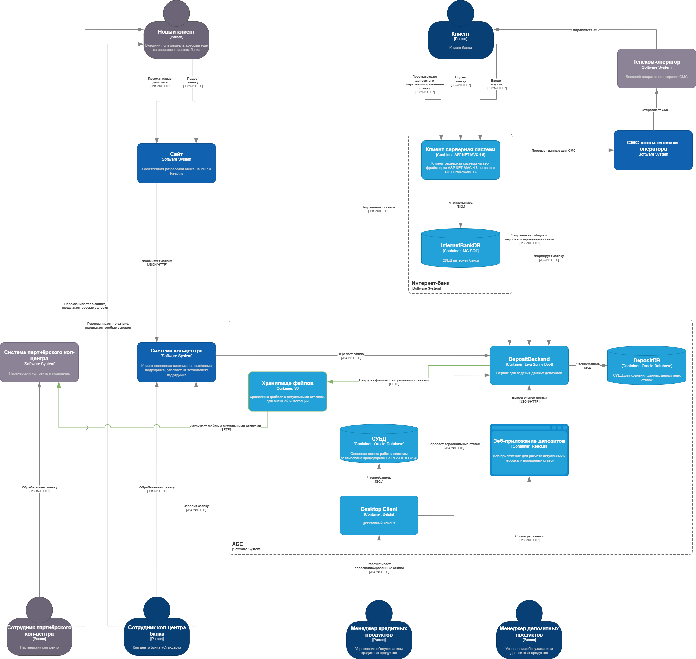

### **Название задачи: Передача ставок в кол-центр**

### **Автор: Вертипрахов Илья**

### **Дата: 30.08.2025**

### **Функциональные требования**

| **№** | **Действующие лица или системы** | **Use Case**                                                                              | **Описание**                                                                                                                                                                                                                                                                                                                                                                                                                                     |
| :------: | :---------------------------------------------------------- | :------------------------------------------------------------------------------------------ | :--------------------------------------------------------------------------------------------------------------------------------------------------------------------------------------------------------------------------------------------------------------------------------------------------------------------------------------------------------------------------------------------------------------------------------------------------------- |
|  UC1  | Клиент, колл-центр                         | Уточнение условия открытия депозита по телефону | 1. Клиент звонит в кол-центр 2. Сотрудники кол-центра через систему актуализирует данные 3. Сотрудник кол-центра консультирует клиента                                                                                                                                                                                              |
|  UC2  | Клиент, партнерский колл-центр  | Уточнение условия открытия депозита по телефону | 1. Клиент звонит в кол-центр 2. Кол-центр перегружен 3. Клиент перенаправляется на партнерский кол-центр 4. Сотрудник партнерского кол-центра через файлы актуализирует данные 5. Сотрудник партнерского кол-центра консультирует клиента |

### **Нефункциональные требования**

| **№** | **Требование**                                      |
| :------: | :-------------------------------------------------------------- |
|   R1   | Нет возможности сделать API-вызовы |
|   R2   | Чувствительные данные должны быть защищены при передаче |

### **Решение**

Диаграмма контейнеров:

### **Альтернативы**

1. Эндпоинт в DepositBackend для выгрузки файлов. Придется предоставлять доступ ко внутреннему контуру
2. Отдельно интеграционное API для выгрузки файлов. Дополнительная нагрузка на разработчиков для поддержки апи

**Недостатки, ограничения, риски**

1. Ручная актуализация данных
2. Дополнительные траты на S3
